# API Gateway Setup
In part 1 we've set up the legacy application (backend and frontend).   
The first step towards Microservice architecture is to front the legacy monolithic application 
with an API Gateway. While there are a variety of API Gateway solutions available, we will leverage AWS API Gateway. 
We take this first step to make all future cutovers transparent to the end-users, as long as the contract between the 
client and the server is maintained.

API gateway allows you to define **Resources** and **Methods**. 
First we will create the **Unicorns** resources and then we will add the **User** resources. Once done, we will create the relevant HTTP methods (GET/POST/DELETE) for each resource which will be used to front the legacy REST API's.

Below is a list of resources and methods that the monolithic application expose. We need to ensure that we create all of the below resources and methods using API Gateway **(all are mandatory)**:
```diff
Create user: POST: [baseUrl]/user
Login user: POST: [baseUrl]/user/login
Get unicorns: GET: [baseUrl]/unicorns
Add unicorn to basket: POST: [baseUrl]/unicorns/basket
Remove unicorn from basket: DELETE: [baseUrl]/unicorns/basket
Get basket: GET: [baseUrl]/unicorns/basket/{userUuid}
```

<details>
<summary>	
<b>Step 1: Create API</b>
</summary>
<br>

**1.1** Log into your AWS console.

**1.2** Navigate to API Gateway.  

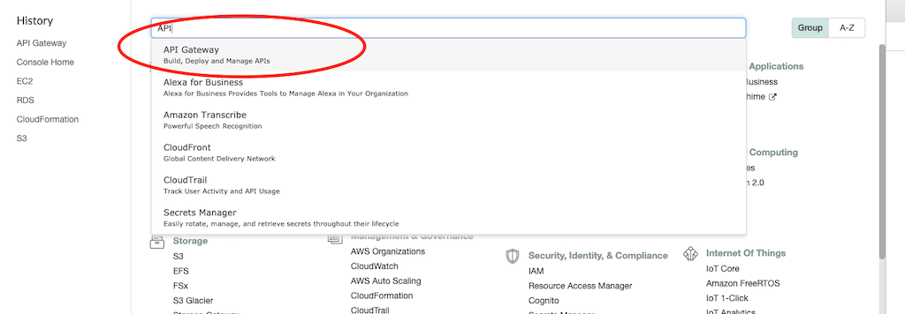  

**1.3** If you have never used the API Gateway service before, you will be presented with the initial page depicted below.
Click on **Build** under the **REST API** section to build your first API.  

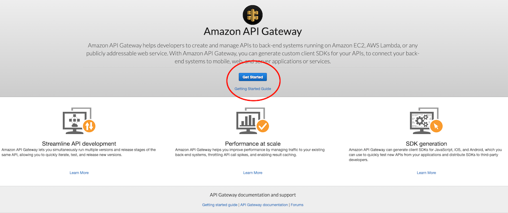  

**1.4** To configure the API, use the following configuration parameters and click **Create API**.
```diff
API Type/Protocol: REST API
Create: New API
API name: Unicorns
Endpoint Type: Edge optimized
```
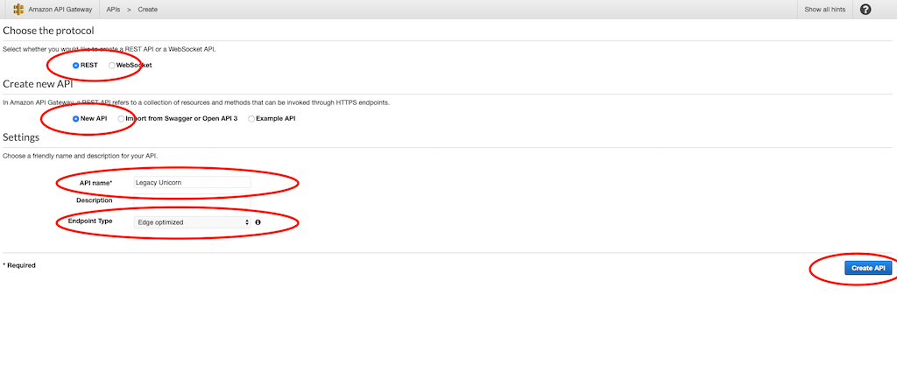  

</details>

<details>
<summary>	
<b>Step 2: Create resources</b>
</summary>
<br>

  <details>
  <summary>	
  <b>Step 2.1: Create Unicorn resources</b>
  </summary>
    <br>
  
   **2.1.1** From the Action menu, select **Create Resource**.
    <br>
    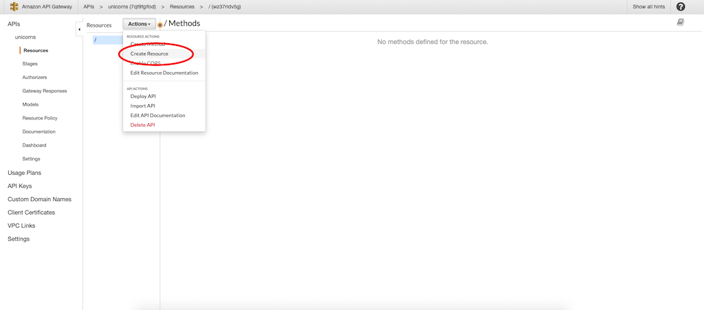
    
   **2.1.2** Configure the new resource and click the **Create resource** button
   
   ```diff
Resource Name: unicorns
Resource Path: /unicorns
- Note: you MUST tick the "Enable API Gateway CORS"
```
   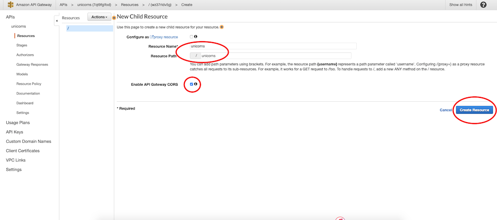  
   
   **2.1.3** On the left side resources menu select the newly created resource **(/unicorns)** and continue with creating the **basket** nested resource.
   
   **2.1.4** From the Action menu, select **Create Resource**.    
    
   **2.1.5** Configure the new resource and click the **Create resource** button.
    
   ```diff
Resource Name: basket
Resource Path: /basket
- Note: you MUST tick the "Enable API Gateway CORS"
```
   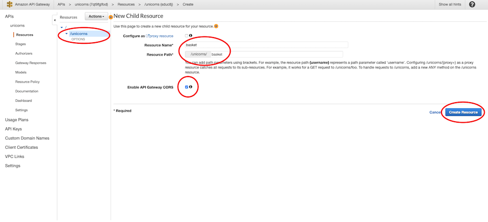  
   
   **2.1.6** On the left side resources menu select the newly created resource **(/basket)** and continue with creating the **/{uuid}** nested resource.
   
   **2.1.7** From the Action menu, select **Create Resource**.    
    
   **2.1.8** Configure the new resource and click the **Create resource** button.
    
   ```diff
Resource Name: {uuid}
Resource Path: /{uuid}
- Note: you need to manually change -uuid- to {uuid}"
- Note: you MUST tick the "Enable API Gateway CORS"
```
   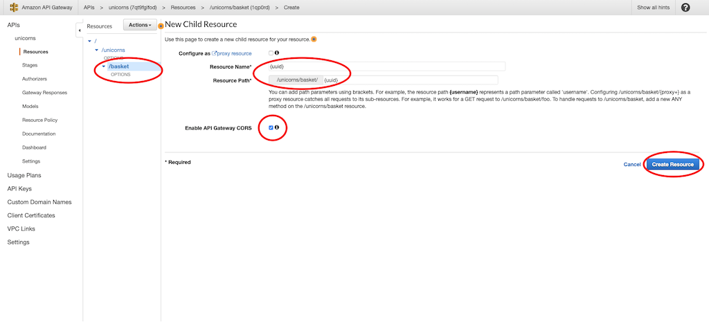  
   
   **2.1.9** Once you've finished with the above steps you should see the below unicorns nested resource structure.
   <br>
   
   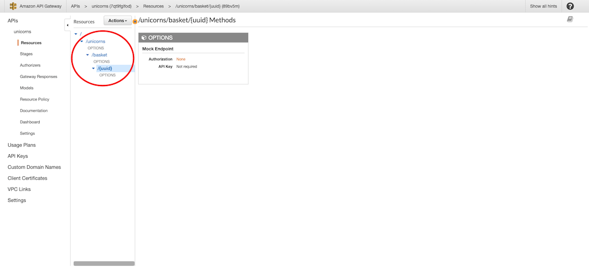
   
  </details>

  <details>
  <summary>	
  <b>Step 2.2: Create User resources</b>
  </summary>
  <br>
  
  **2.2.1** On the left side resources menu select the top level blank resource.
   
  **2.2.2** From the Action menu, select **Create Resource**.    
    
  **2.2.3** Configure the new resource and click the **Create resource** button.
    
   ```diff
Resource Name: user
Resource Path: /user
- Note: you MUST tick the "Enable API Gateway CORS"
```
     
  
  **2.2.4** On the left side resources menu select the newly created resource **(/user)** and continue with creating the **/login** nested resource.
   
   **2.2.5** From the Action menu, select **Create Resource**.    
    
   **2.2.6** Configure the new resource and click the **Create resource** button.
    
   ```diff
Resource Name: login
Resource Path: /login
- Note: you MUST tick the "Enable API Gateway CORS"
```
   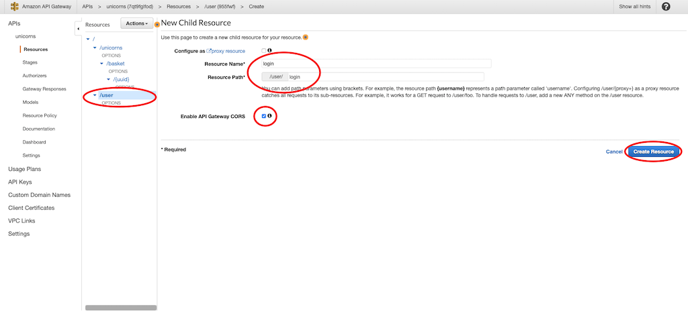  
  
  **2.2.7** Once you've finished with the above steps you should see the below resource structure.
   <br>
   
   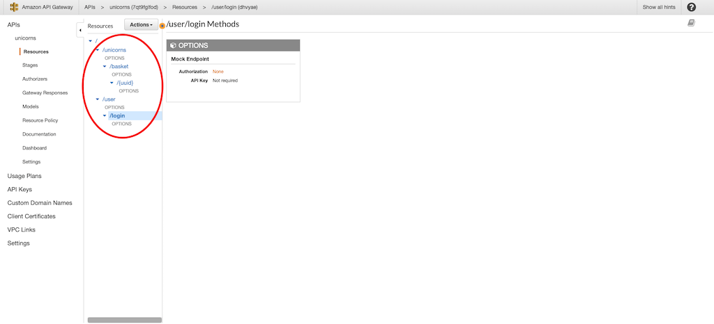
  
  </details>

</details>
  
<details>
<summary>	
<b>Step 3: Create methods</b>
</summary>
  
<br>
  
  <details>
  <summary>	
  <b>Step 3.1: User methods</b>
  </summary>
    <br>
  
  On the **/user** resource we will create 2 methods
  <br>
  **1. Create user**
  <br>
  **2. User Login**
  
  **3.1.1** On the resources left side menu select the **/user** resource and from the Actions menu select **Create Method**.
  <br>
    
  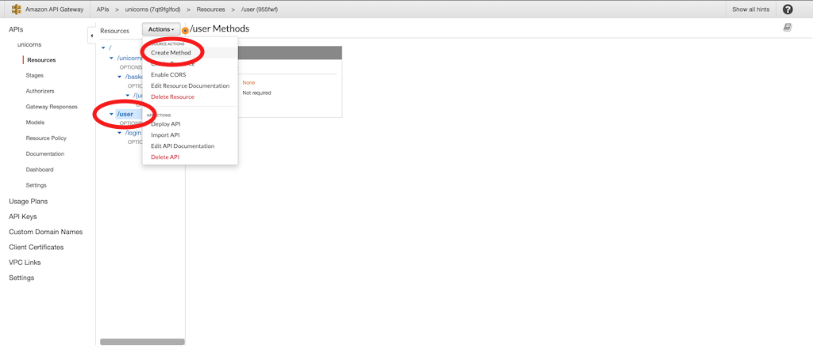
    
  **3.1.2** From the method type dropdown menu select **POST** and click the confirmation tick
   
  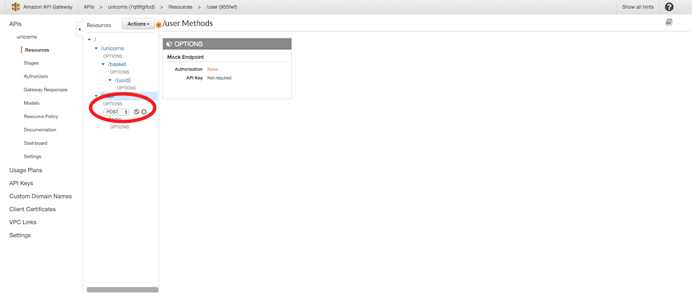
   
  **3.1.3** Configure the new **/user POST** method with the below values and click the **Save** button.

  ```diff
  Integration type: HTTP
  Use HTTP proxy integration: Not ticked
  HTTP method: POST
  Endpoint URL: [base URL copied from CloudFormation output]/user
  Content handling: Passthrough
  Use default timeout: Ticked 
  ```

  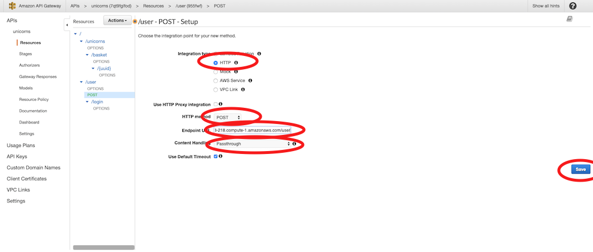
  
  **3.1.4** Once the method configuration is saved we can test the integration with the legacy backend. Click the **TEST** button
    
  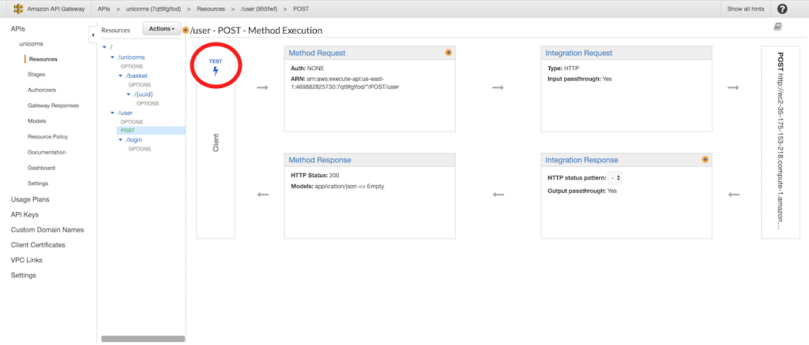
  
  **3.1.5** Copy and paste the below JSON into the request body and press the **Test** button. If all configured correctly you should get a **200** response with body that includes the newly created user **uuid** 
  ```diff
  - Make sure you replace the values in the below JSON to reflect the user you wish to create
  ```
  ```json
    {
	    "email":"Replace with your emails address",
	    "firstName":"Replace with your first name",
	    "lastName":"Replace with your last name"
    }
  ```
  
  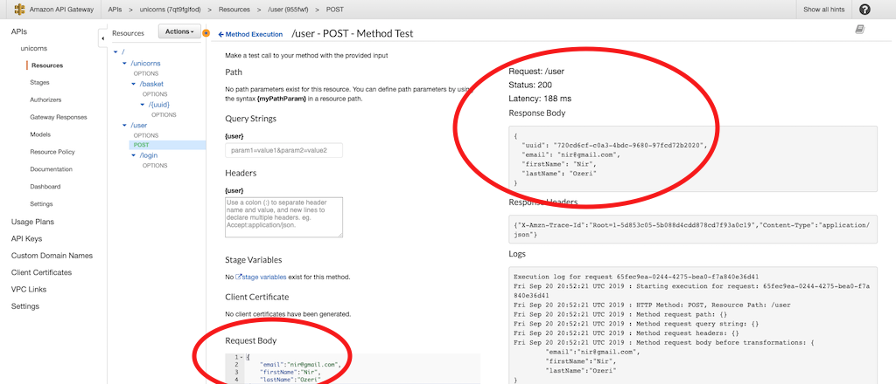
   
  **3.1.6** That's it! you've just created your first API gateway method which is connected to our legacy application. Next, we will configure the **/user/login** method. 
  
  **3.1.7** Select the **/user/login** resource on the resources left side menu and using the **Actions** dropdwon menu create a new method. Configure the newly created method as **POST** and click the tick. 
   
  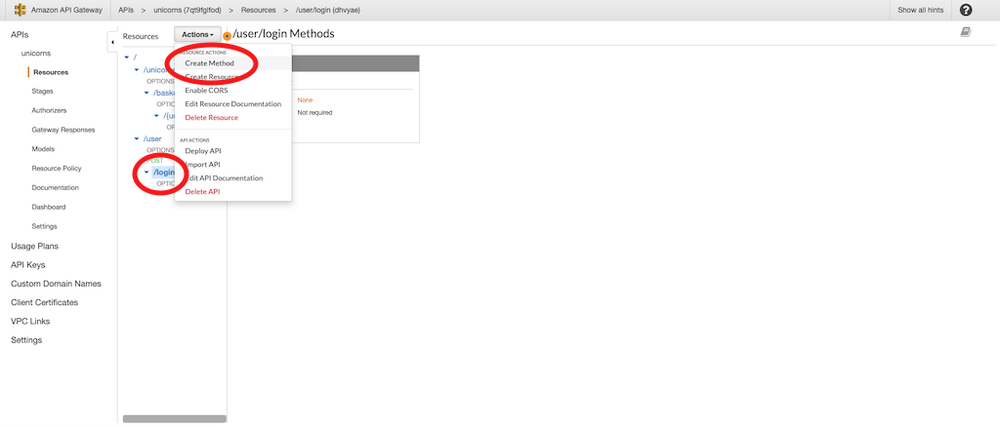
  <br>
  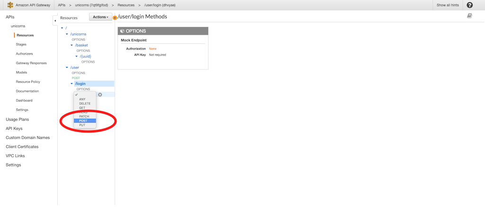
  
  **3.1.8** Configure the new **/user/login POST** method with the below values and click the **Save** button.

  ```diff
  Integration type: HTTP
  Use HTTP proxy integration: Not ticked
  HTTP method: POST
  Endpoint URL: [base URL copied from CloudFormation output]/user/login
  Content handling: Passthrough
  Use default timeout: Ticked 
  ```
  
  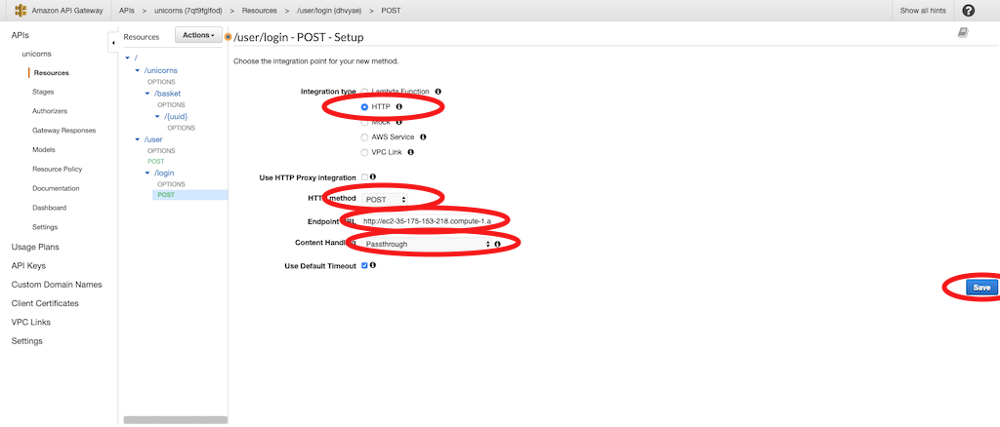
  
  **3.1.9** Once the method configuration is saved we can test the integration with the legacy backend. Click the **TEST** button
  
  **3.1.10** Copy and paste the below JSON into the request body and press the **Test** button. If all configured correctly you should get a **200** response with body that includes the user email and user uuid
  ```diff
  - Make sure you replace the value in the below JSON to reflect the user you wish to login with
  ```
  ```json
    {
	    "email":"Replace with your emails address"
    }
  ```
  
  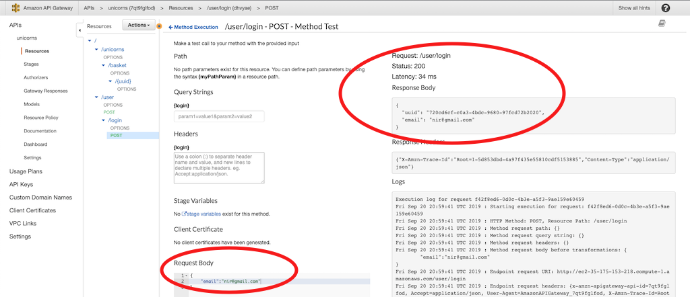
  
  **3.1.6** That's it for the user methods. To recap, we've created 2 resources 
  * /user
  * /user/login
  and on each resource we've created a POST method which are now connected to the legacy backend.
  In the next section we will configure the **/unicorn** resources methods. 
     
   </details>
   
   <details>
  <summary>	
  <b>Step 3.2: Unicorns methods</b>
  </summary>
 
  On the **/unicorns** resource we will create 4 methods
  <br>
  **1. Get unicorns**
  <br>
  **2. Add unicorn to basket**
  <br>
  **3. Remove unicorns from basket**
  <br>
  **4. Get the basket**
  
  **3.2.1** On the resources left side menu select the **/unicorns** resource and from the **Actions** menu select **Create Method**.
  <br>
    
  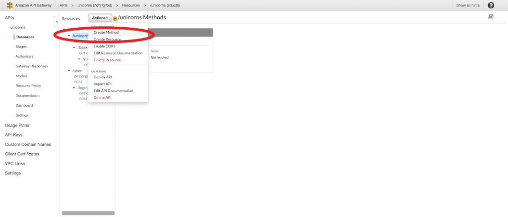
    
  **3.2.2** From the method type dropdown menu select **GET** and click the confirmation tick
   
  **3.2.3** Configure the new **/unicorns GET** method with the below values and click the **Save** button.

  ```diff
  Integration type: HTTP
  Use HTTP proxy integration: Not ticked
  HTTP method: GET
  Endpoint URL: [base URL copied from CloudFormation output]/unicorns
  Content handling: Passthrough
  Use default timeout: Ticked 
  ```

  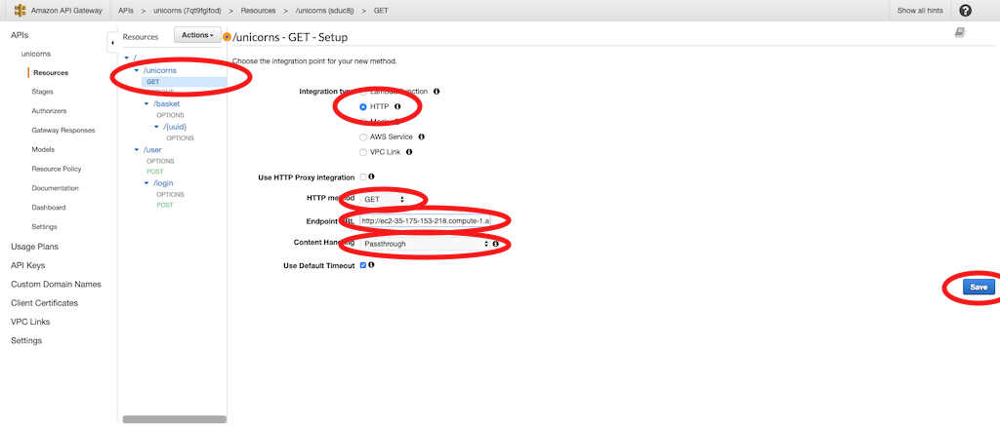
  
  **3.2.4** Once the method configuration is saved we can test the integration with the legacy backend. Click the **TEST** button
  
  **3.2.5** Press the **Test** button **(no values are needed)**. If all configured correctly you should get a **200** response with body that lists the available unicorns 
  
  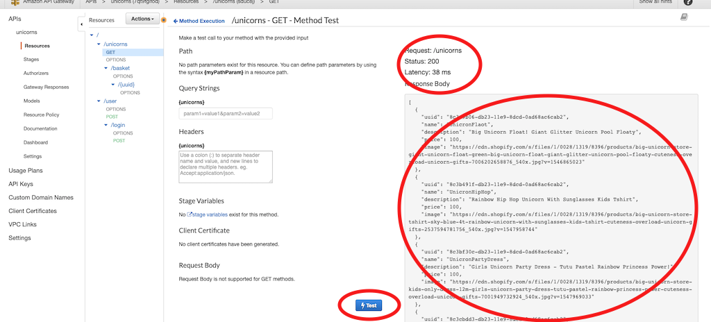
     
  **3.2.6** Select the **/unicorns/basket** resource on the resources left side menu and using the **Actions** menu create a new method. Configure the newly created method as **POST** and click the tick. 
   
  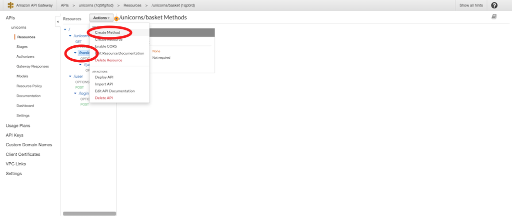
  <br>
  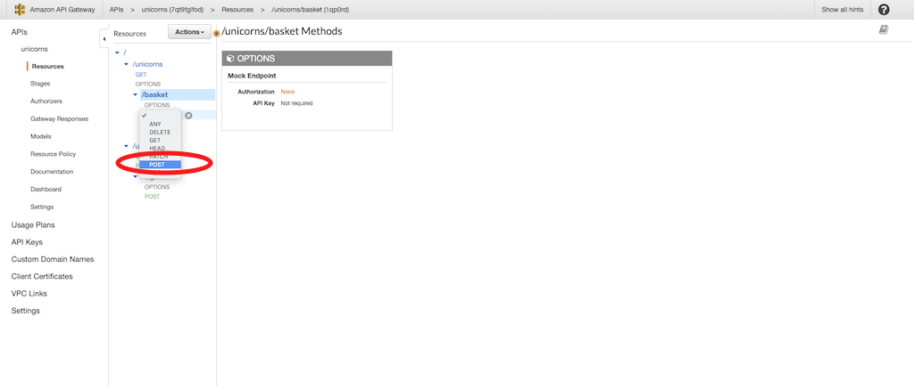
  
  **3.2.7** Configure the new **/unicorns/basket POST** method with the below values and click the **Save** button.

  ```diff
  Integration type: HTTP
  Use HTTP proxy integration: Not ticked
  HTTP method: POST
  Endpoint URL: [base URL copied from CloudFormation output]/unicorns/basket
  Content handling: Passthrough
  Use default timeout: Ticked 
  ```
  
  
  
  **3.2.8** Once the method configuration is saved we can test the integration with the legacy backend. Click the **TEST** button
  
  **3.2.9** Copy and paste the below JSON into the request body and press the **Test** button. If all configured correctly you should get a **200** response with **no data** in the body
  ```diff
  - Make sure you replace the values in the below JSON to reflect the unicorn you wish to add to basket
  ```
  ```json
    {
	"uuid":"4b3fc86b-81d0-4614-920e-8184063acf2d",
	"unicorns":
	[
		{
			"uuid":"8c3a9b06-db23-11e9-8dcd-0ad68ac6cab2"
		}
	]
    }
  ```
  
  
  
  **3.2.10** Select the **/unicorns/basket** resource on the resources left side menu and using the **Actions** menu create a new method. Configure the newly created method as **DELETE** and click the tick. 
   
  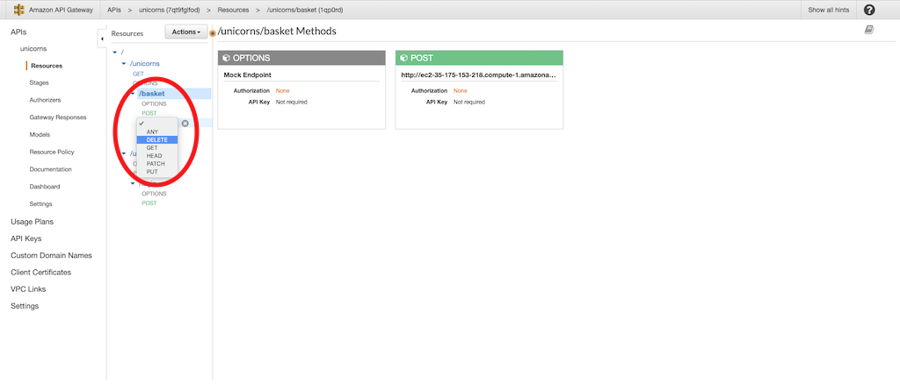
  
  **3.2.11** Configure the new **/unicorns/basket DELETE** method with the below values and click the **Save** button.

  ```diff
  Integration type: HTTP
  Use HTTP proxy integration: Not ticked
  HTTP method: DELETE
  Endpoint URL: [base URL copied from CloudFormation output]/unicorns/basket
  Content handling: Passthrough
  Use default timeout: Ticked 
  ```
  
  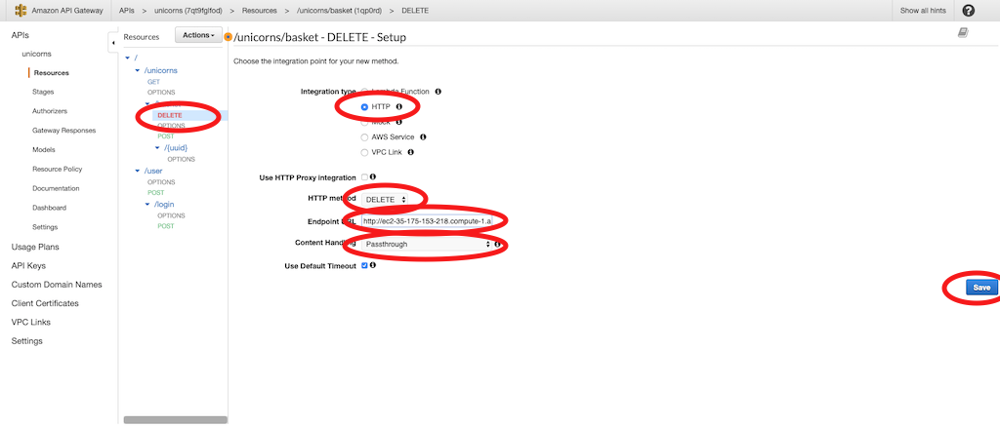
  
  **3.2.12** Once the method configuration is saved we can test the integration with the legacy backend. Click the **TEST** button
  
  **3.2.13** Copy and paste the below JSON into the request body and press the **Test** button. If all configured correctly you should get a **200** response with **no data** in the body
  ```diff
  - Make sure you replace the values in the below JSON to reflect the unicorn you wish to remove from basket
  ```
  ```json
    {
	"uuid":"4b3fc86b-81d0-4614-920e-8184063acf2d",
	"unicorns":
	[
		{
			"uuid":"8c3a9b06-db23-11e9-8dcd-0ad68ac6cab2"
		}
	]
    }
  ```
  
  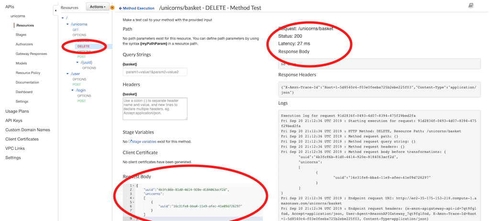
  
  **3.2.14** Select the **/unicorns/basket/{uuid}** resource on the resources left side menu and using the **Actions** menu create a new method. Configure the newly created method as **GET** and click the tick. 
   
  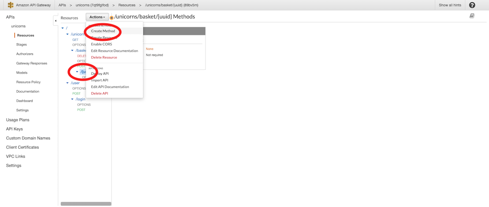
  <br>
  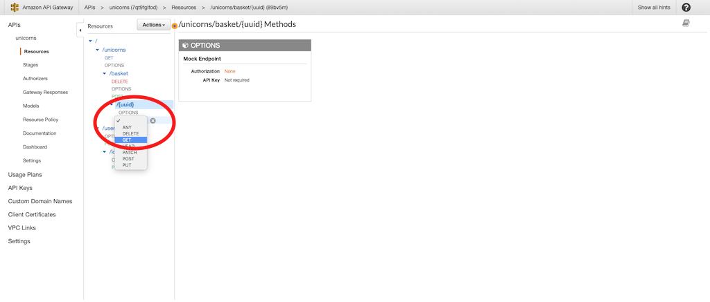
  
  **3.2.15** Configure the new **/unicorns/basket/{uuid} GET** method with the below values and click the **Save** button.

  ```diff
  Integration type: HTTP
  Use HTTP proxy integration: Not ticked
  HTTP method: GET
  Endpoint URL: [base URL copied from CloudFormation output]/unicorns/basket/{uuid}
  Content handling: Passthrough
  Use default timeout: Ticked 
  ```
  
  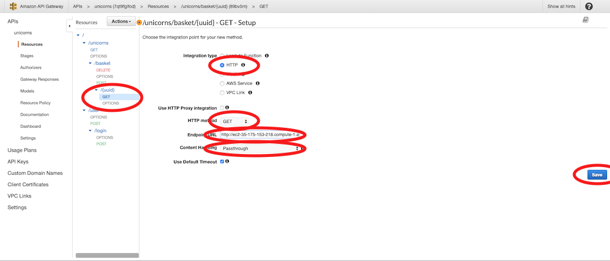
  
  **3.2.16** Once the method configuration is saved we can test the integration with the legacy backend. Click the **TEST** button
  
  **3.2.17** Paste the user uuid into the path uuid field and press the **Test** button. If all configured correctly you should get a **200** response with the user JSON basket
  
  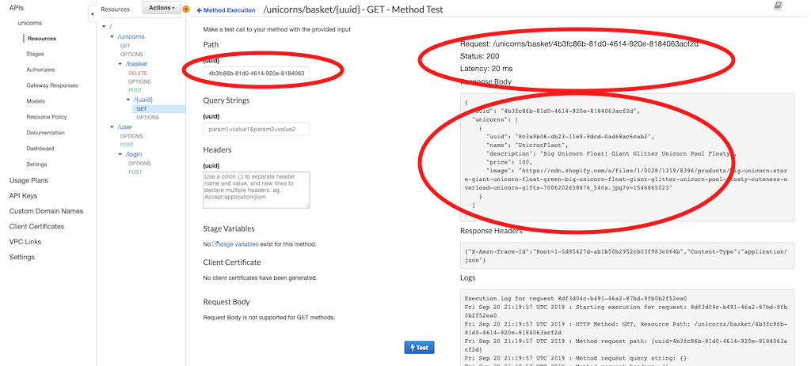
  
  **3.2.18** That's it for the /unicorns methods. To recap, we've created 3 resources 
  * /unicorns
  * /unicorns/basket
  * /unicorns/basket/{uuid}
  In addition, we've created 
  * GET method to get the list of unicorn (under /unicorns)
  * POST method to add a unicorn to basket (under /unicorns/basket)
  * DELETE method to remove unicorn from basket (under /unicorns/basket)
  * GET method to retrive the user basket (under /unicorns/basket/{uuid})
  
  **3.2.19** Once completed all resources and methods set up your API Gateway dashboard should look as follows  
  
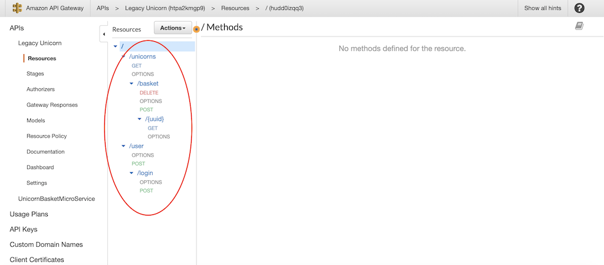  

  In the next section we will deploy the API and connect the UI to the new API gateway setup. 
   
   </details>
</details>   

<details>
<summary>	
<b>Step 4: Deploy API</b>
</summary>
<br>

At this point, we've configured our API Gateway to front our legacy application, but, we have one more step to complete. In order for us to access the API publicly, we need to deploy them. 

**4.1** before you deploy, make sure to enable CORS again on /user and /unicorns resources as the newly created methods do not inherit the resource CORS configuration by default. To enable CORS again, select a resource on the left side resource menu, click on the **Actions** button and select **Enable CORS**. Repeat the process for all resources! 
```diff
- Note: This step is mandatory otherwise you will get CORS errors and the site will not work
```

**4.2** Click on the top level resource (empty). From the **Actions** menu select **Deploy API**.  

  

**4.3** Give the new deployment a name, e.g. **dev**, and press **Deploy**.  
<br>
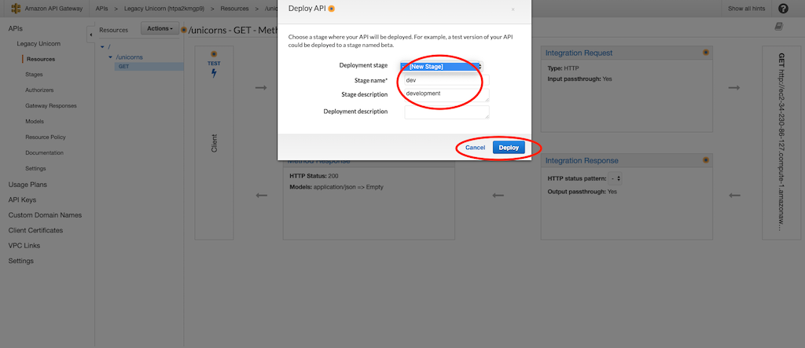

**4.4** Copy the Invoke URL link that is presented, this URL will allow us to make calls to the legacy application via API Gateway similar to when you previously accessed your application via the EC2 DNS name.

<br>

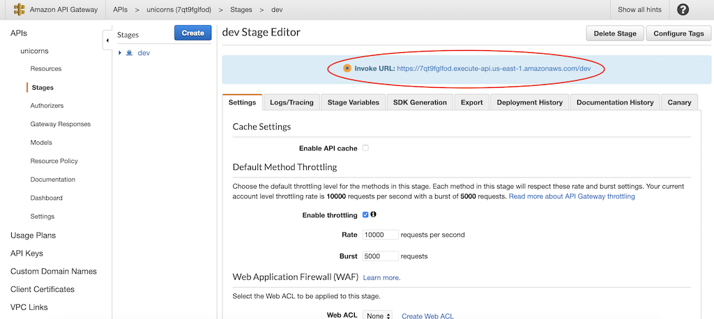  

**4.5** Let's test it, copy the invoke URL and paste it to the address bar in your browser. Add to the end of the url **/unicorns**, otherwise, you will likely get a "Missing Authentication Token" error. 

<br>

  

You should see the below response 
<br>
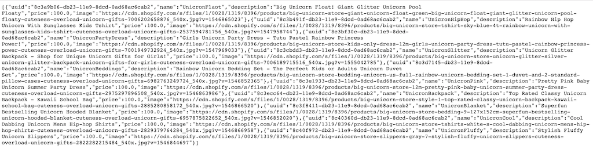  

**4.6** Lastly, let's point the frontend to use the new URL provided by API Gateway. Update config.json with the API gateway deployment URL and upload it to S3 static website.   

Once uploaded, you can refresh your browser and you should see content served from the new URL. You can check that on your browser's developer console, by checking that the *host* points to your API URL.
```diff
- Note: make sure the URL is a secured using HTTPS
- Note: make sure the file is uploaded with read public access, otherwise the site will not load properly!
```
  
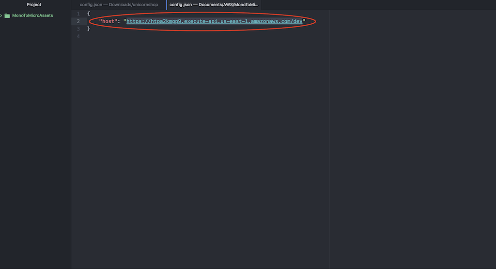


</details>
