# DynamoDB Setup (~10 min)
Using microservices architecture gives you freedom to choose different technologies for your implementation. We will use
DynamoDB as our database for our shopping cart microservice. DynamoDB is fast key/value store which can hold shopping cart information and enable quick reads and writes.

<!--There are 2 ways you can create DynamoDB table, you can use the below **DynamoDB deployment using CloudFormation** section which is using, as the name suggest, CloudFormation for deployment. Or, you can create the table manually (see **DynamoDB manual deployment** section)-->

<details>
<summary>  
<b>Step1: DynamoDB deployment using CloudFormation</b>
</summary>
<br>

**1.1** Download CloudFormation template from [here](../MonoToMicroAssets/MonoToMicroCFDDB.yaml) and save it locally

```diff
Save file name: MonoToMicroDDBCF.yaml
```

**1.2** Log into your AWS console.

**1.3** Navigate to CloudFormation.

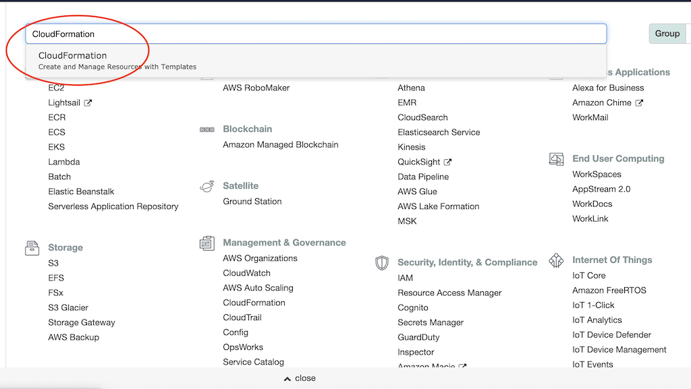

**1.4** Click **Create stack** to start the process.  

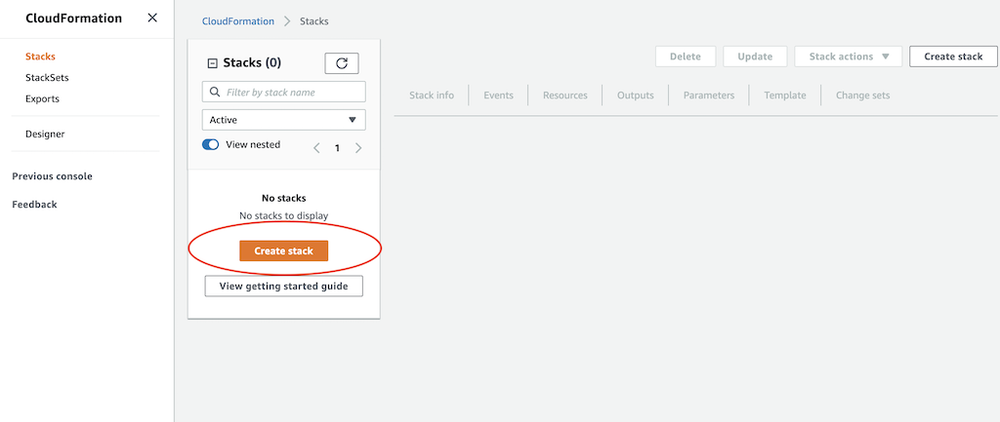

**1.5** Select **Template is ready** with **Upload a template file** and load the file downloaded on step 1.1 

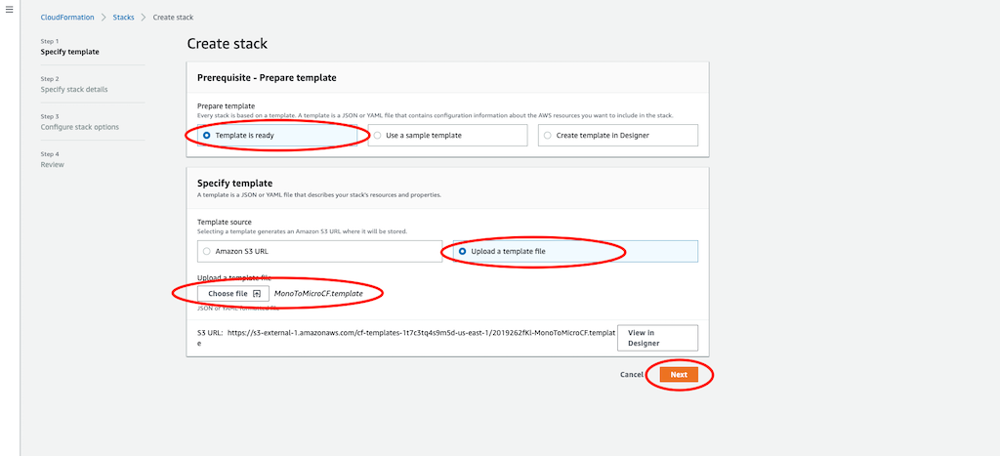 

**1.6** Click **Next**.

**1.7** Enter a name for the stack, e.g. MonoToMicrDDB  

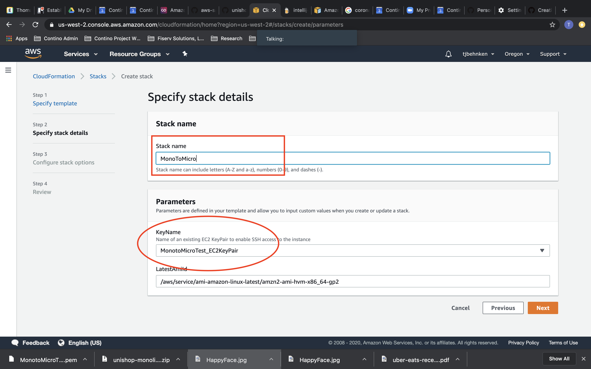  

**1.8** Click **Next** to skip the stack configuration options, as we will use defaults in this section.  

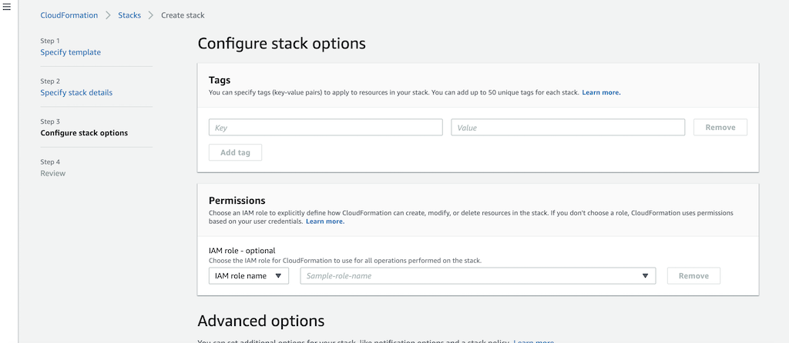

**1.9** Review the details for creating the stack and click **Create Stack**.  

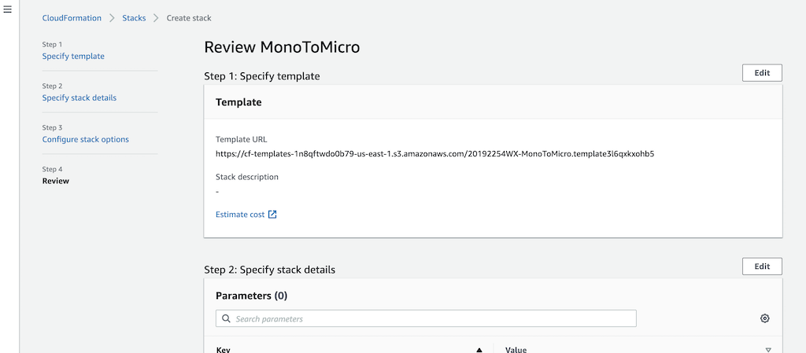

**1.10** The CloudFormation stack creation process will take 3-4 minutes to complete.  

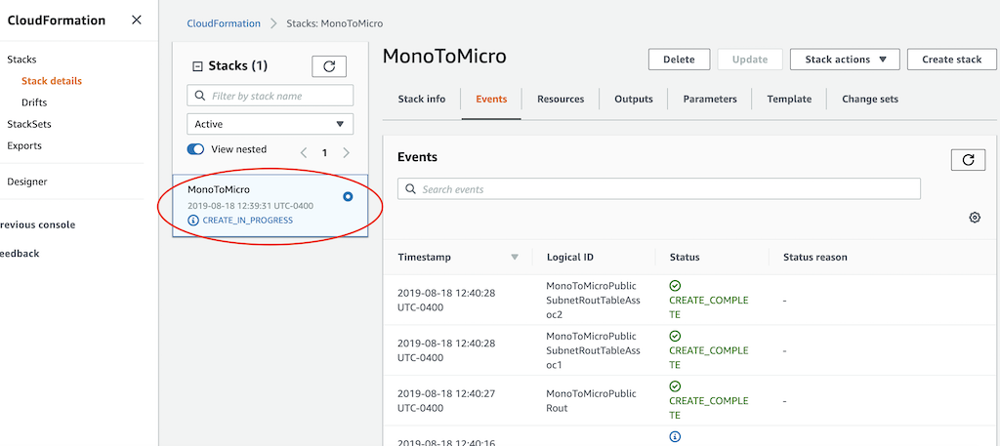

**1.11** Once the stack creation process completes, you should see the following **CREATE_COMPLETE** message.  

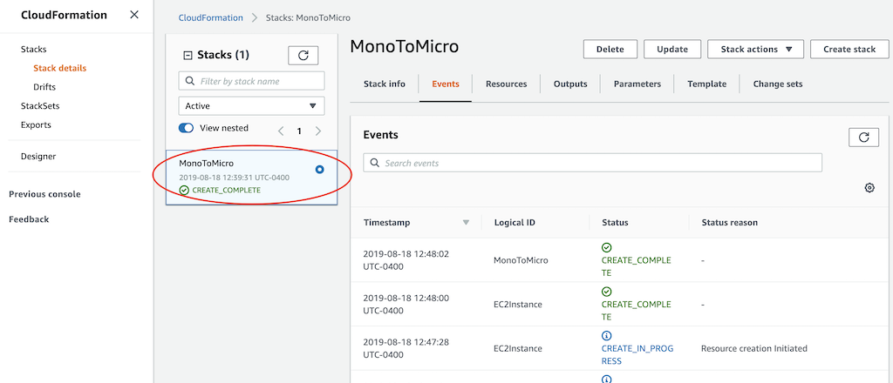

**1.12** Click on the Outputs tab and take note of these values.
```diff
RoleForLambda: This is the IAM role that will be used with our Lambda function.
```

</details>
<!--
OR
    
<details>
<summary>  
<b>Step 1 (again): DynamoDB manual deployment</b>
</summary>
<br>

**1.1** Log into your AWS console.  

**1.2** Navigate to DynamoDB.    

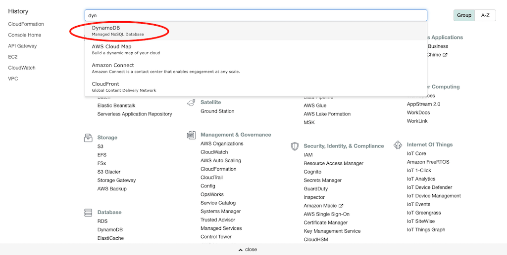  
  
**1.3** Select **Create table**  

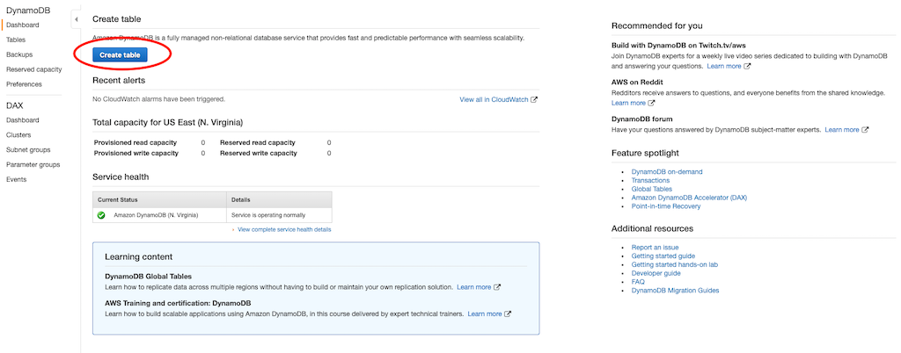  
  
**1.4** Use the following names (lower case)  

```diff
Table Name: unishop  
Primary Key: uuid  
```
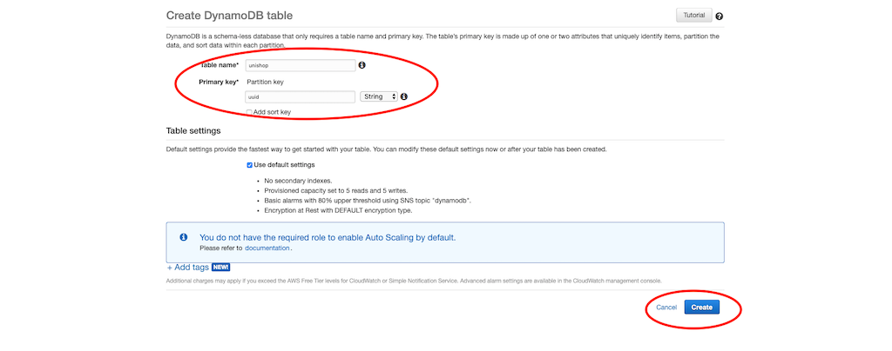  

Click the **Create** button  

**1.5** Create the role for your Lambda functions to be able to access DynamoDB  

As you are creating the table manually, we will need to create an IAM Role that will give our AWS Lambda functions permissions to access the DynamoDB table that you have just created.

1.5.1 Take note of the ARN for the newly created DynamoDB table  
1.5.2 Visit the [IAM home page](https://console.aws.amazon.com/iam/home)  
1.5.3 From the left side menus select **Roles** and then press the **Create role**  
1.5.4 Using **AWS Service** and **Lambda** use case then click **Next**  
1.5.5 In the permissions section, search for **AWSLambdaBasicExecutionRole** and select it. Click **Next**
1.5.6 Skip the **Tag** section
1.5.7 Name the role as **MonoToMicroLambdaRole** and create the role   
1.5.8 Select that role and add an inline policy that gives it the following access permissions to **your** DynamoDB table: GetItem, Query, Scan, DeleteItem, PutItem, UpdateItem. Name it as DynamoDBPermissions.
  
**1.6** You are DONE!  

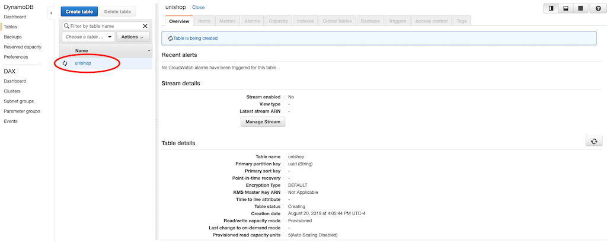  

</details>
-->
