# Lambda Setup (~20 min)
Now that we have a new DynamoDB table to which the shopping cart can be persisted, let's add 3 Lambda serverless functions that can be invoked in lieu of calling the monolithic application.

We will start with methods set up and then hook API gateway with the mnethods.

<details>
<summary>  
<b>Step 1: Methods setup</b>
</summary>
<br> 

**1.1** As part of the build process we've compiled the Lambda Java code into a JAR file which we will use for our Lambda method invocation. The jar file can be found in S3 under the unishop-assets-xxxxx folder (xxxxx is a random number which is generated as part of the build). Download the Jar file to your local machine. 

**1.2** Navigate to the Lambda page.   

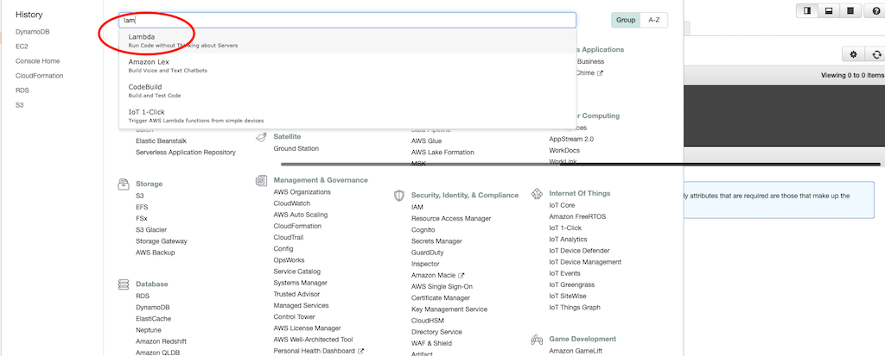

**1.3** If it is the first time you are using Lambda you will see the introduction page. Click **Create a function** to start.  

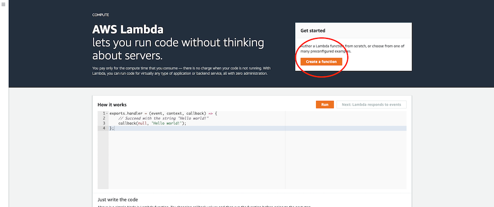

**1.4** Select the **Author from scratch**, and use the following configuration parameters and click **Create function**
```diff
Function name: AddUnicornToBasket
Runtime: Java 8
Permissions: Use an existing role from the dropdown list
```
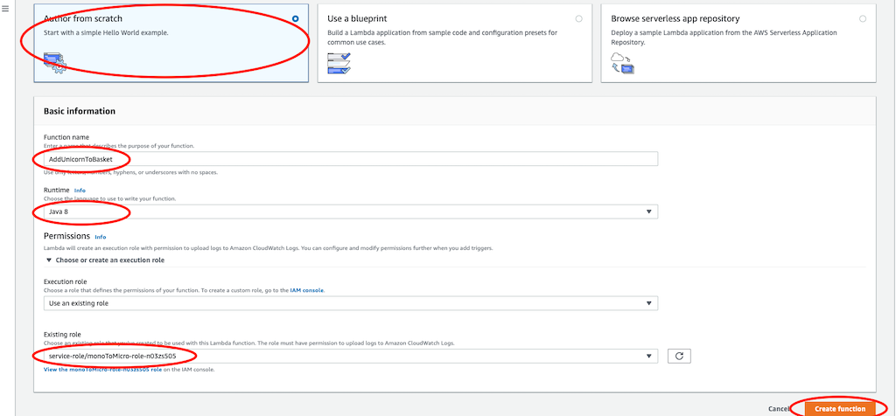

**1.5** Upload the jar file that was downloaded in step 1.1, it would be used for method execution.

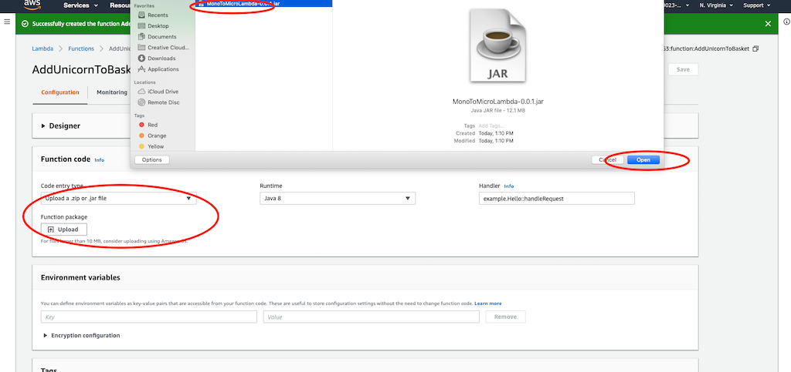

**1.6.** Next we need to configure the handler. You will do that by pointing to the class name and the method within the
class. Copy below handler definition and paste it to the handler field. Once added, click **Save**.

```diff
com.monoToMicro.Lambda.UnicornBasketImpl::addUnicornToBasket
```

```diff
    NOTE: There are two components to the above string:
    Before the "::" is the class name: `com.monoToMicro.Lambda.UnicornBasketImpl`
    After the "::" is the method name: `addUnicornToBasket`    
```
    
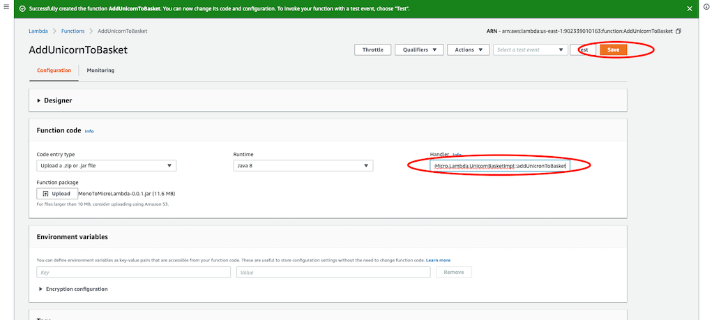

**1.7.** Now that we have the function set up, let's test it. Click **Select a test event** and select **Configure test events**.   

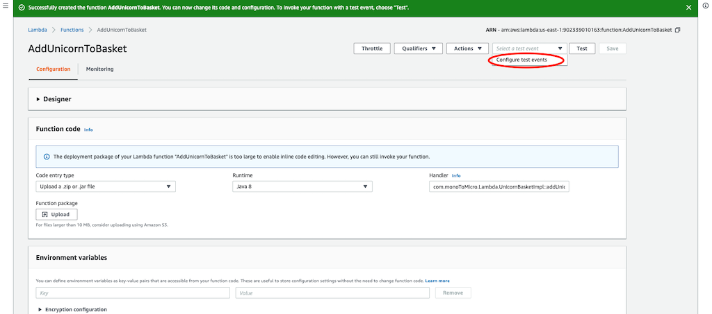

**1.8.** Name the event as **AddUnicornToBasket**, fill in the JSON to use, and click the Create button. See below for an
example event. 
```
{
    "uuid": "4b3fc86b-81d0-4614-920e-8184063acf2d",
    "unicorns": [
        {
            "uuid": "16c3e7c0-bba4-11e9-afec-41e09d726297"
        }
    ]
}
```  


**1.9.** Click **Test** to invoke the function with your example event. It may take few seconds for the function to invoke
on the first execution, as the function is performing some one-time initialization. See below for sample execution
output.  

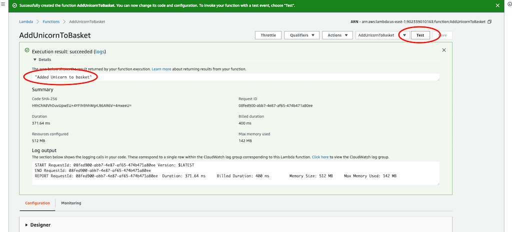

**1.10.** Navigate to DynamoDB, select the unishop table, and click on the **Items** tab. You should see at least one entry in your table that matches the test event payload.   

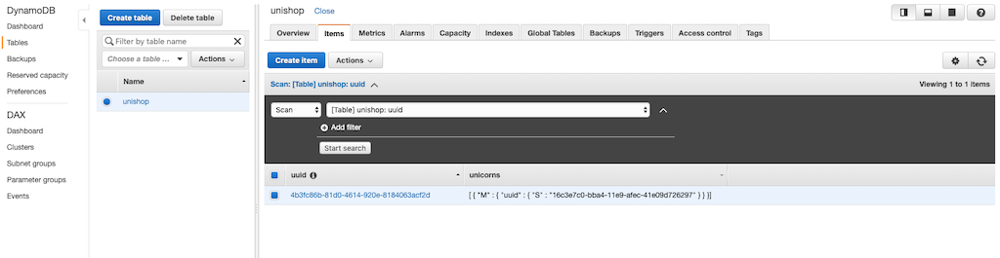

**1.11.** Repeat the same steps for the the next 2 methods

**Remove Unicorn From Basket** with the following properties
```diff
Function name: RemoveUnicornFromBasket
Runtime: Java 8
Permissions: Use an existing role from the dropdown list
Handler: com.monoToMicro.Lambda.UnicornBasketImpl::removeUnicornFromBasket
```
and 

**Get Unicorns Basket** with the following properties
```diff
Function name: GetUnicornsBasket
Runtime: Java 8
Permissions: Use an existing role from the dropdown list
Handler: com.monoToMicro.Lambda.UnicornBasketImpl::getUnicornsBasket
```

To test this last one, use a payload with the UUID of the basket

~~~
{
  "uuid": "4b3fc86b-81d0-4614-920e-8184063acf2d"
}
~~~

</details>

<details>
<summary>  
<b>Step 2: Integrate Lambda methods with API Gateway</b>
</summary>
<br>

The Lambda functions are ready, the next step is to use API gateway (as it is already fronting
the legacy application) and switch between the endpoints so API gateway will point to the Lambda method instead of poniting to the legacy HTTP REST endpoint.

As we building a shopping cart microservice we will ask API gateway to direct incoming shopping cart requests to use the Lambda methods we've just created for 3 methods
* **AddUnicornToBasket**
* **RemoveUnicornFromBasket**
* **GetUnicornsBasket**

The AddUnicornToBasket and RemoveUnicornFromBasket are straightforward (follow the below steps for the Add method and replicate the same steps for the Remove). However, the GetUnicornsBasket requires a little bit more attention as it is using mapping from path variable (uuid) to JSON object (which is part of the Lambda method signature). Follow the steps carefully and it should all be fine!  

**2.1** Navigate to the API Gateway page.  

**2.2** Click through to the Resources menu and select the **/unicorns/basket** POST method  

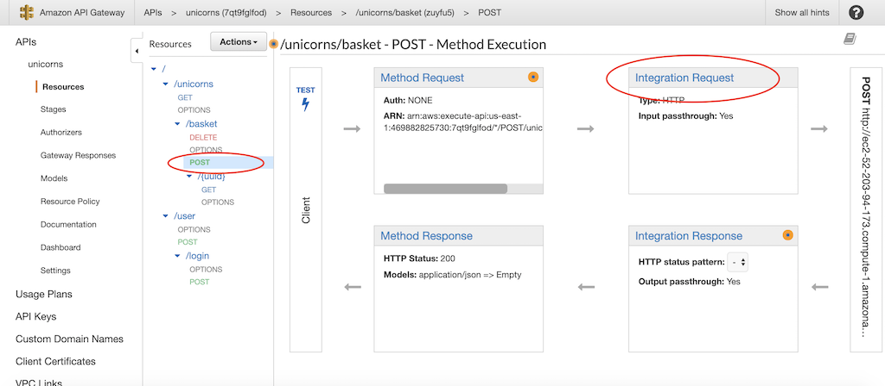  
  
**2.3** Click on Integration Request and update the configuration as follows and click **Save** and **OK** when completed.
```diff
Integration type: Lambda function
Lambda region: select the region you've been using
Lambda function: select the AddUnicornToBasket function (you might need to start typing to see the options in the dropdown menu)  
```
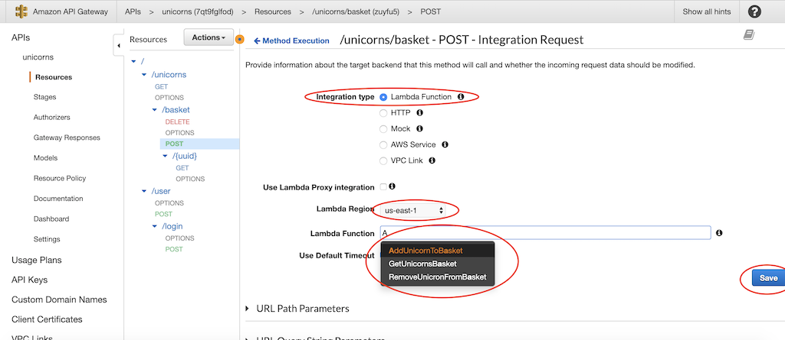  
<br>
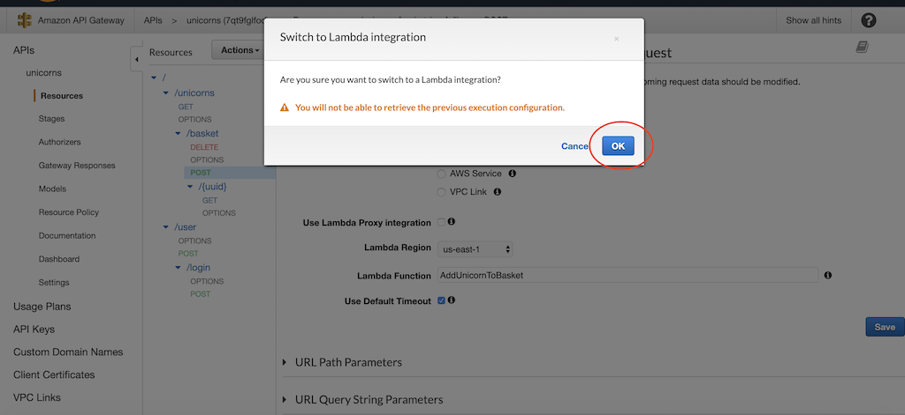  

**2.4** From the Action menu, select **Deploy API**. Choose the **dev** deployment.

**2.5** Go ahead and test your API gateway endpoint with the Lambda integration. In the **body** section paste the below JSON  
**2.6** 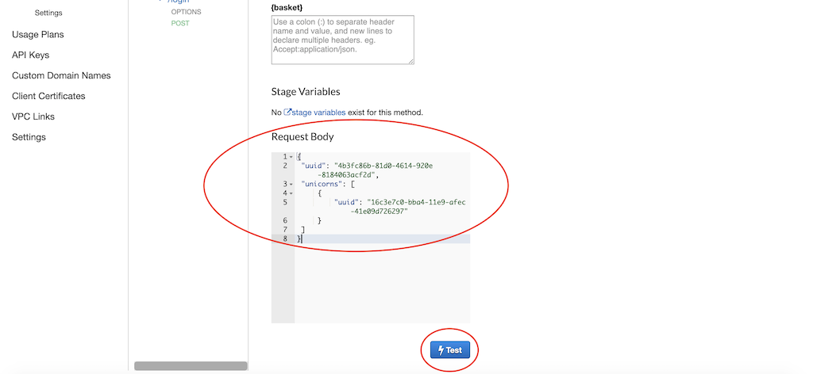  

```diff
- NOTE: Make sure you replace the uuid's with uuid's which you got as part of step 2.2 in the first part of this lab
{
    "uuid": "4b3fc86b-81d0-4614-920e-8184063acf2d",
    "unicorns": [
        {
            "uuid": "16c3e7c0-bba4-11e9-afec-41e09d726297"
        }
    ]
}
```

**2.7** You can navigate to DynamoDB table and see the values in the table->items section

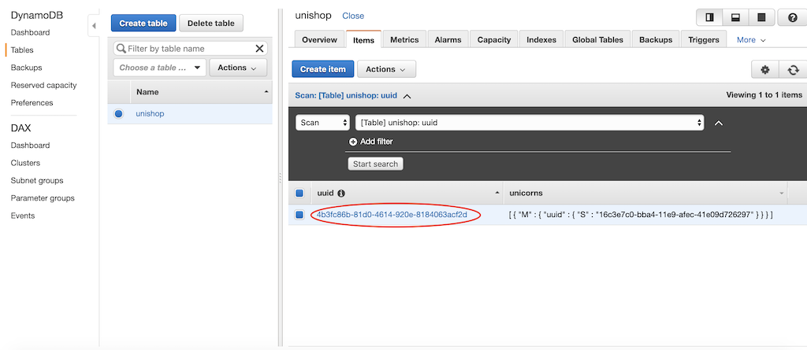  

**2.8** Repeat the same steps for the DELETE method. You can use the same content for testing the Remove method. Once tested you can see the below response from the Lambda method and the DynamoDB table empty.  

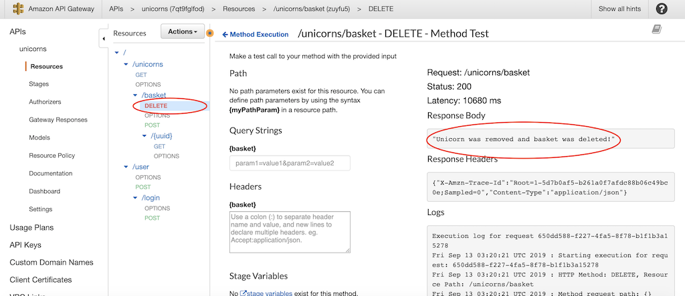  
<br>
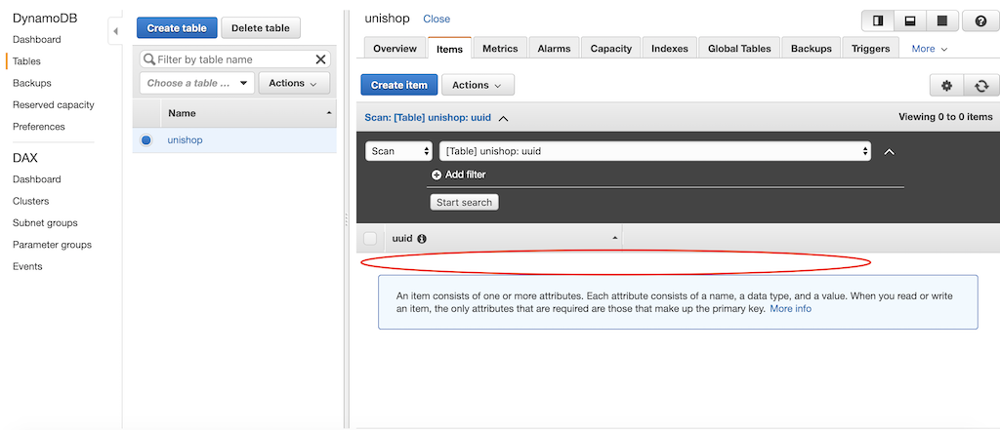  

**As mentioned, setting up the GET basket request requires couple more steps. First we will create a model which is a JSON representation of the UnicornBasket model. Once created, we will use it as a template for mapping incoming GET requests to a POJO (Plain Old Java Object) which will feed into the Lambda function. Simple!**  

**2.9** Navigate to the model section from the left side menu and click Create

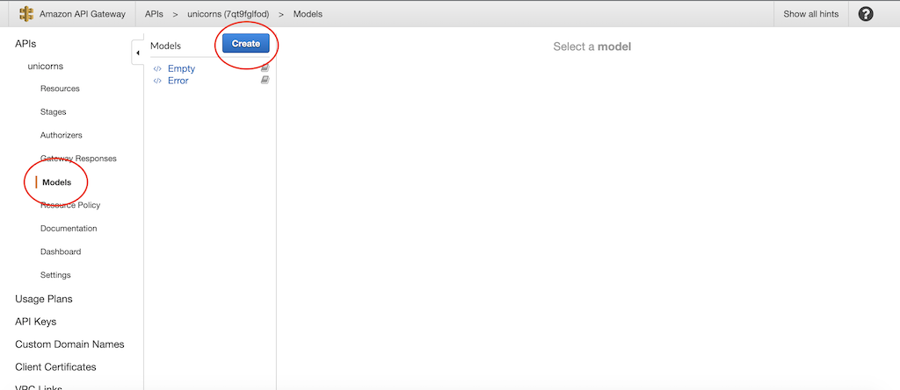   

**2.10.** Fill in a model name **UnicornBasket** and content type **application/json** and copy the below code into the schema area    

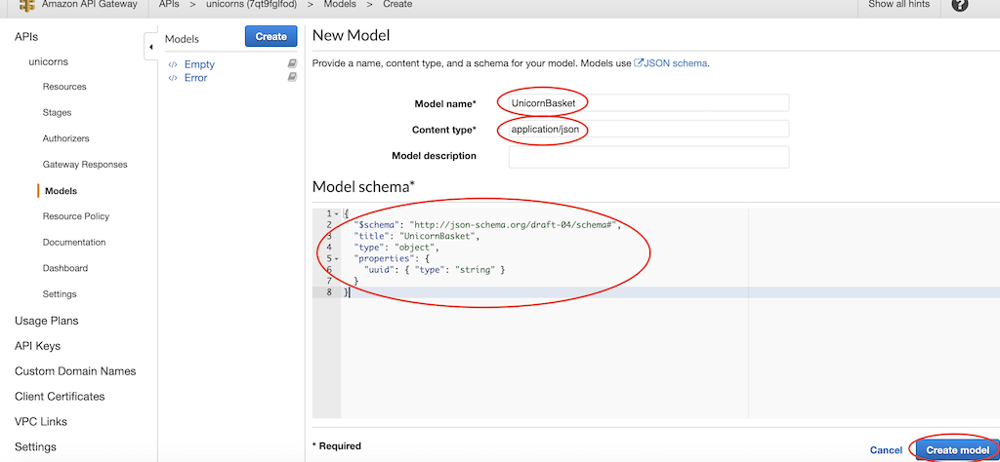   
```
Content type: application/json
Model name: UnicornBasket

{
  "$schema": "http://json-schema.org/draft-04/schema#",
  "title": "UnicornBasket",
  "type": "object",
  "properties": {
    "uuid": { "type": "string" }
  }
}
```

**2.11** Navigate to the GET method under the unicorn/basket API, change the integration type to Lambda and choose the **GetUnicornsBasket** and click **Save**. Next, expand the mapping template section at the bottom of the page

   

**2.12** Add new mapping template with **application/json** as content type and select the newly created template from the dropdown menu

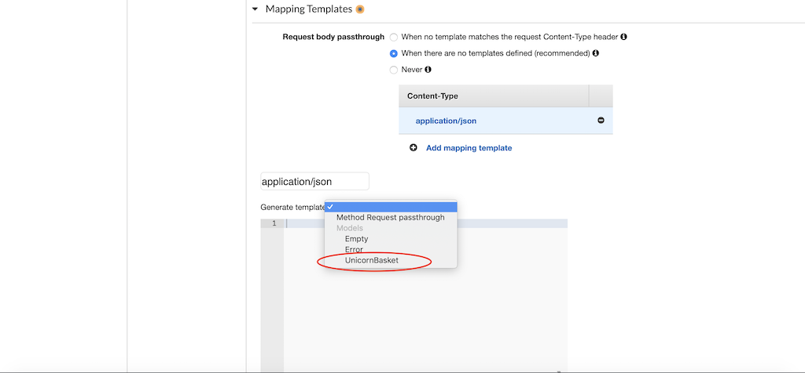  
<br>
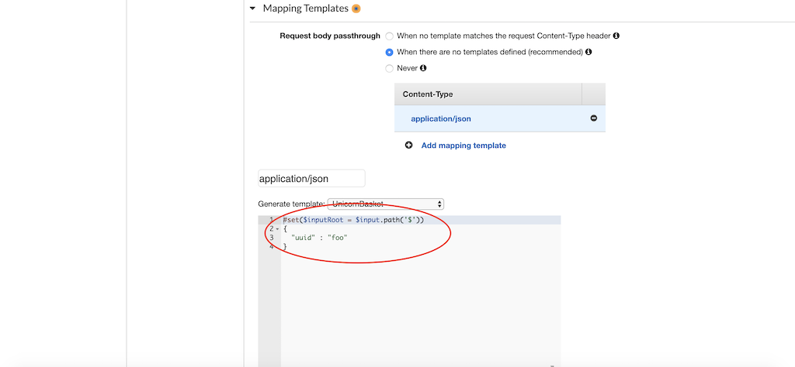  

**2.13** Add the following code into the template area
```
#set($inputRoot = $input.path('$'))
{
  "uuid" : "$input.params('uuid')"
}
```  
  

**2.14** Save and test the GET Lambda method. If all is set up properly you should see the below response  

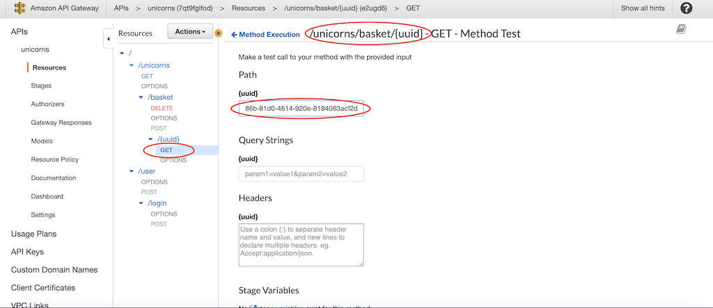  
<br>
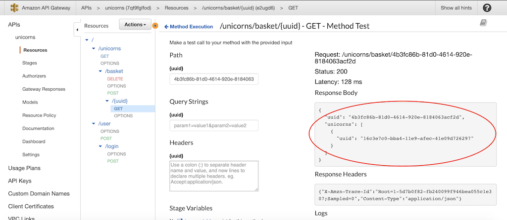  

**2.15** Before we redeploy the API, make sure you reenable the CORS on all the Unicorns resources.

**2.16** We need to redeploy the API after the changes, click on the top level resource (empty). From the **Actions** menu select **Deploy API**.  

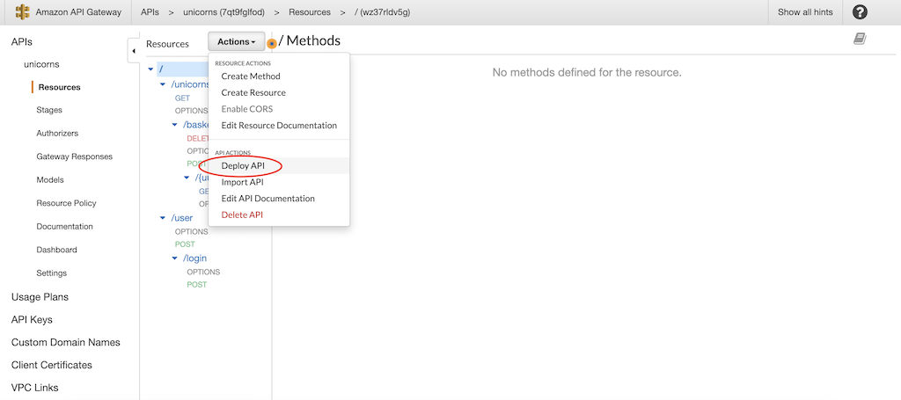  

**2.17** If all is set properly, you should be able to refresh the UI in your browser and see that your Unishop is loading as usual.  

```diff
+ Note that the all process is transparent to the end user and he is not aware that the data is being served from different location  
```

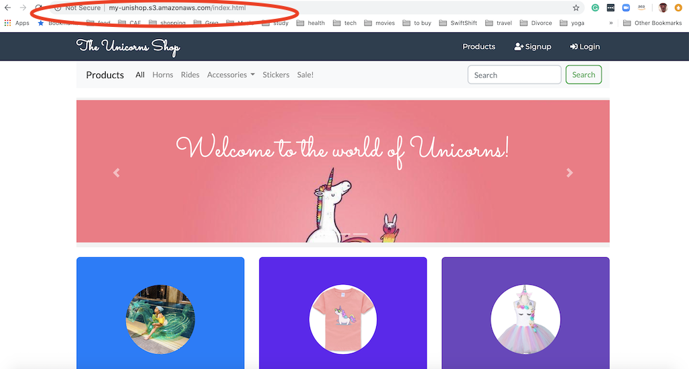

</details>
