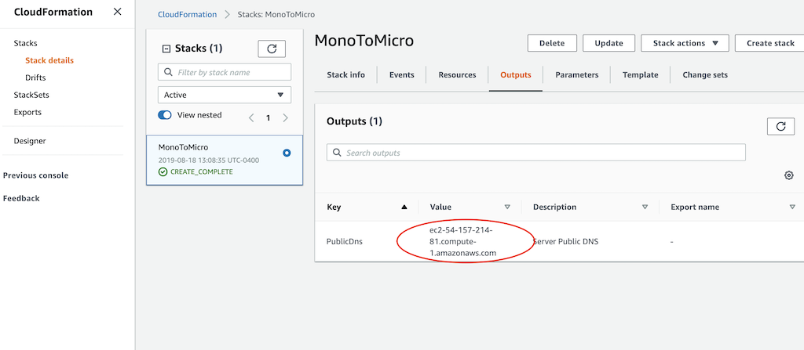
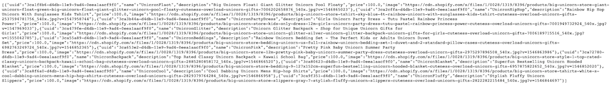
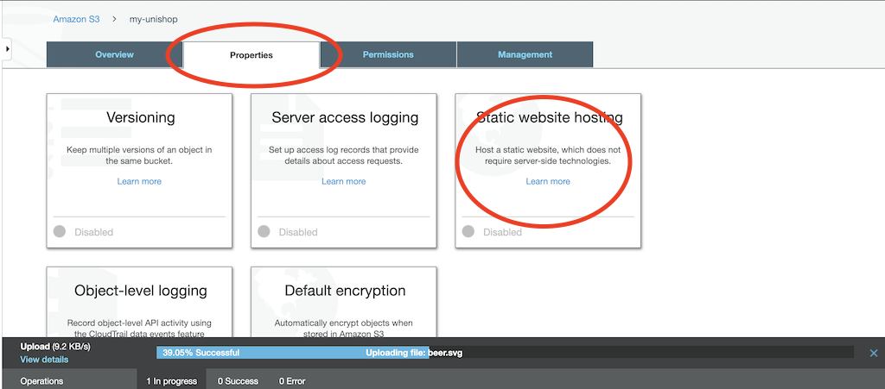
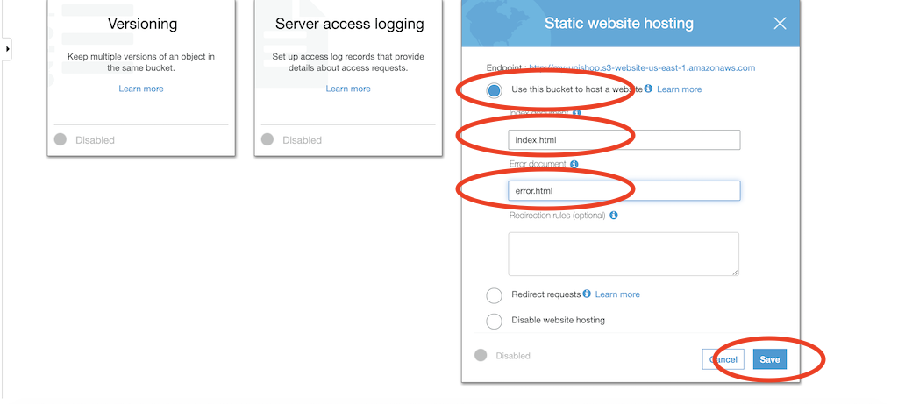
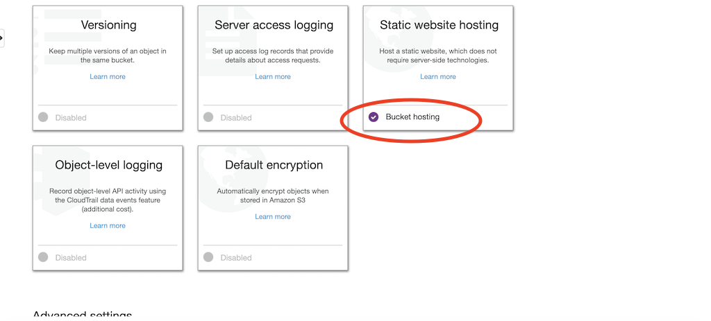
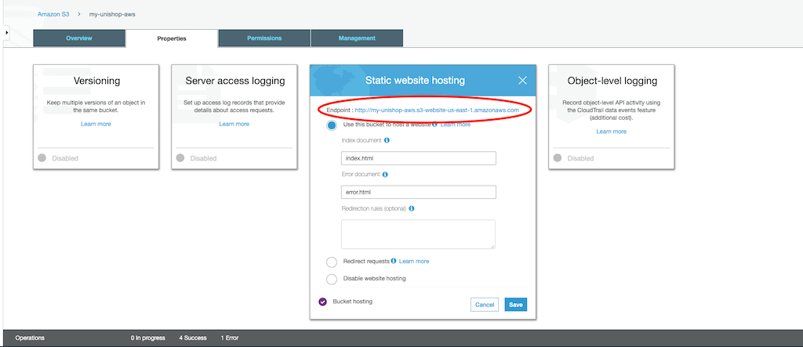
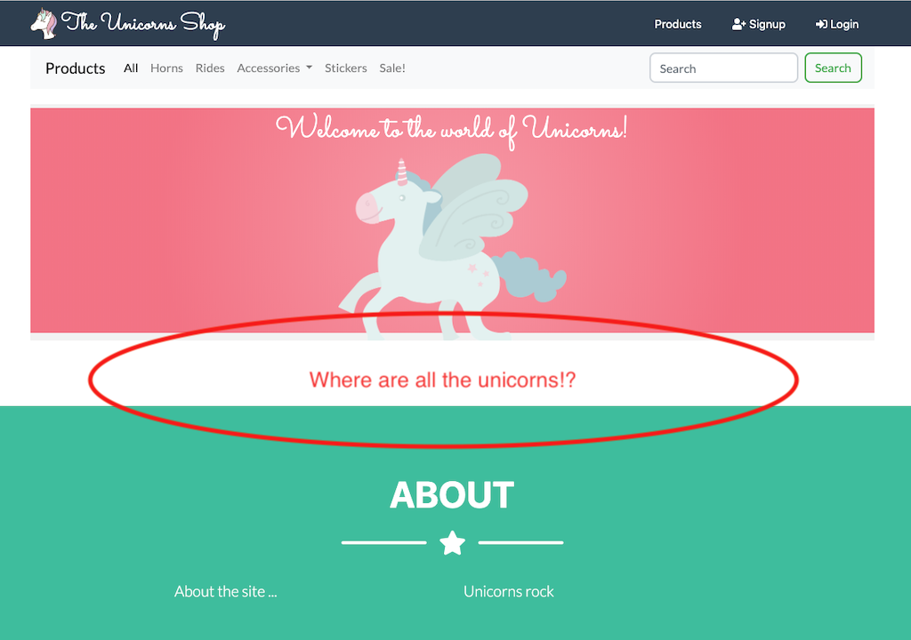
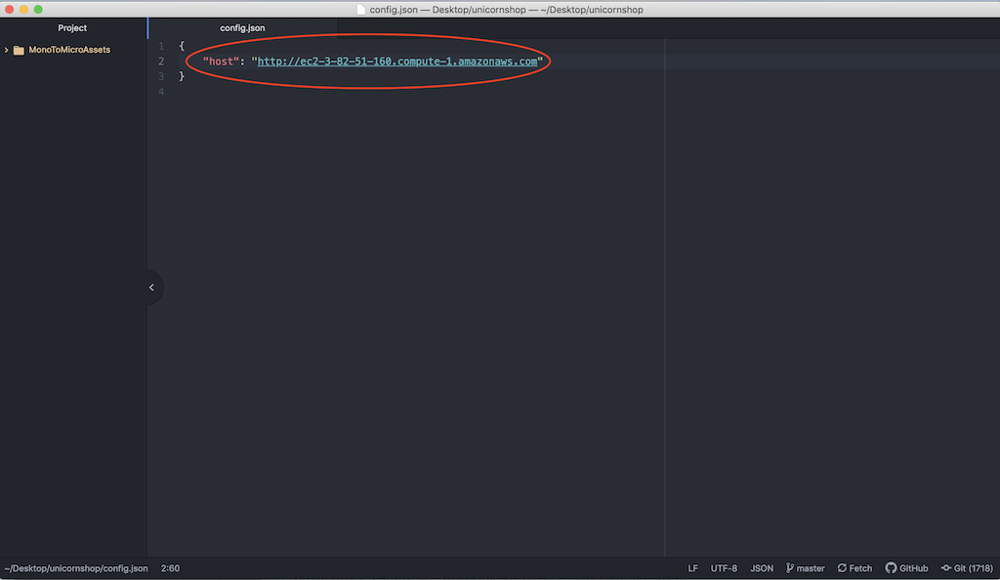

# Legacy Monolithic Application Deployment
Our Unishop legacy application is a Spring Boot Java application connected to a MySQL database with frontend written
using bootstrap.

The app is deployed on a single EC2 instance (t2.micro) within a dedicated VPC using a single public subnet. Note
that this is not the ideal infrastructure architecture for running highly available production applications but
suffices for the purposes of this workshop. Also note that the EC2 security groups will be configured
as "open to the world", and the Database security group will only be open to the EC2 instance.

To configure the infrastructure and deploy the application we will use CloudFormation. CloudFormation is an easy way to
define our required resources as code, enabling a versioned and repeatable mechanism for deploying our infrastructure.

<details>
<summary>	
Step 1: Backend deployment
</summary>
<br>
	
**1.1** Download the CloudFormation template from [here](../MonoToMicroAssets/MonoToMicroCF.template) to your local machine.
```diff
Save file name: MonoToMicroCF.template
```

**1.2** Log into your AWS console. 

**1.3** Navigate to CloudFormation.  
<br>


**1.4** Click "Create stack" to start the process.  
<br>


**1.5** Select "Upload a template file" and "Choose file" to upload the file that you've downloaded in step 1.1. Finally, click "Next" 
<br>
 

**1.6** Enter a name for the stack
```diff
Stack Name: MonoToMicro
```

  

**1.7** Click "Next" to skip the stack configuration options, as we will use defaults in this section.  
<br>


**1.8** Review the details for creating the stack, tick the **I acknowledge that AWS CloudFormation might create IAM resources** box and click **Create Stack**.  
<br>


**1.9** The CloudFormation stack creation process will take up to 30 minutes to complete. The VPC resources will be
created fairly quickly. The database and EC2 resources will be created next while code will be cloned and build process will be initiated (which will take the majority of the time).
While the resources are being created, you will see the following screen and events depicted below. If you are having
issues, call a workshop instructor to help you troubleshoot.  
<br>


**1.10** Once the stack creation process completes, you should see the following **CREATE_COMPLETE** message.  
<br>


```diff
- NOTE: You need to wait for the CloudFormation deployment to complete before you 
- progress to the next step!
```

</details>

<details>
<summary>	
Step 2: Verify backend deployment
</summary>
<br> 

```diff
- NOTE: Make sure CloudFormation deployment is finished and you see the "CREATE_COMPLETE" message
```

**2.1** Click on the Outputs tab and copy the PublicDns value. This is the DNS name for the EC2 instance that is running our **Unishop** application. We will use that DNS name for accessing the application and later for hooking it up with API Gateway.



**2.2** To access the Unishop application, use the copied URL from step 2.1 (e.g. http://ec2-XXX-XXX-XXX-XXX.compute-1.amazonaws.com/unicorns) into your browser or via curl at the command line. You should see a response similar to the below image.

```diff
- NOTE: Use HTTP (not HTTPS) for this GET call and don't forget to add /unicorns at the end of the copied URL
```


Now that we have the backend (java spring boot application) deployed, let's deploy the frontend using S3 static website hosting  

</details>

<details>
<summary> 
Step 3: Frontend deployment
</summary>
<br> 

For the frontend we will use S3 static web hosting. It is a simple yet powerful hosting solution which auto-scale and meet growing needs automatically.  

**3.1** The UI code has been synced and pushed to S3 bucket as part of the build process. Navigate to S3 and find the bucket named **unishop-ui-xxxxx** (where xxxxx is a random number generated by the build process)  

**3.2** Click the **properties** tab, select the **Static website hosting** option.
<br>
  

**3.3** Select the **Use this bucket to host a website**. Use **index.html** and **error.html** as the index and error documents. Press **save**. 
```diff
Tick: "Use this basket to host a web site"
Index document: index.html
Error document: error.html
```
  
<br>
**3.4** Once saved you should see purple tick highlighted on the **Static website hosting**. 
<br>
  
<br>
</details>

<details>
<summary> 
Step 4: Verify frontend deployment
</summary>
<br> 

**4.1** Navigate to **Static website hosting** and click the endpoint URL.  
<br>
  

**4.2** You should see the Unishop landing page, but, unless you are extreamly lucky, you won't see unicorns loading. The reason for that is that the legacy API endpoint is not configured properly. We will need to download config.json file from S3, change the URL within, and reload it to S3.
  

**4.3** Download the config.json file from the **unishop-ui-xxxxx** to your local machine. 
```diff
Save file name: config.json
```
**4.4** Open the newly downloaded config.json file and replace the host URL with the one you copied on step **2.1** above (this will allow the UI to connect to the correct backend URL).  
```diff
- NOTE: Use the copied ULR without the /unicorns
- NOTE: Make sure you are using HTTP (not HTTPS)
- NOTE: Make sure there is no forward slash at the end of the URL
```


**4.5** Upload config.json back to your S3 static website, make sure you grant public access to the file. 
Once uploaded, you can refresh your browser and you should see content served from the new URL  
  
```diff
- NOTE: Make sure you grant public access to the file
```


```diff
- Note: you first need to register and then login in order to add Unicorns to your basket.  
```
  

</details>


